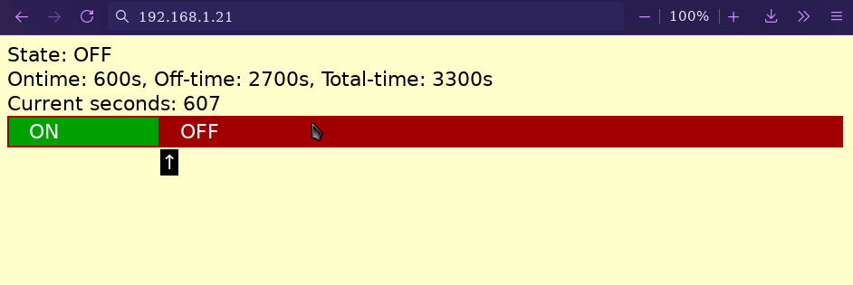

# Arduino ESP8266 Relay Control with basic WiFi API and OTA updates

I needed to control a medical device (a nebulizer compressor), cycling it on for 10 minutes, off for 30, to keep it from overheating.  I've also used this to cycle a Magic Bullet (tm) blender for preparing liposomal nanoemulsions.

This Arduino project controls an ESP8266 (D1 Mini) board, with a "Relay Shield" on it (on pin 5).

* It currently has hard-coded periods of time for the ON cycle, and the OFF cycle.
* It accepts <i>http://{ip}/sleep</i> to jump to the off cycle
* It accepts <i>http://{ip}/reset</i> to jump to the on cycle
* / home shows the above status screen

## Usage:

* Copy wifi\_config--example.h to wifi\_config.h and edit your IP, lan/over-the-air domain name, etc.
* Edit main.h for your relay pin (currently pin 5)
* Edit main.h for your ON time and OFF time.
* *Note: Relay is ON on HIGH. That would need a bit more coding to flip.*

## Notes:

* Make sure to install the ArduinoOTA library from the Arduino library manager. The ESP8266 OTA apparently does not work with the Arduino-packaged version.
* Ignore all the files in reference/ 
